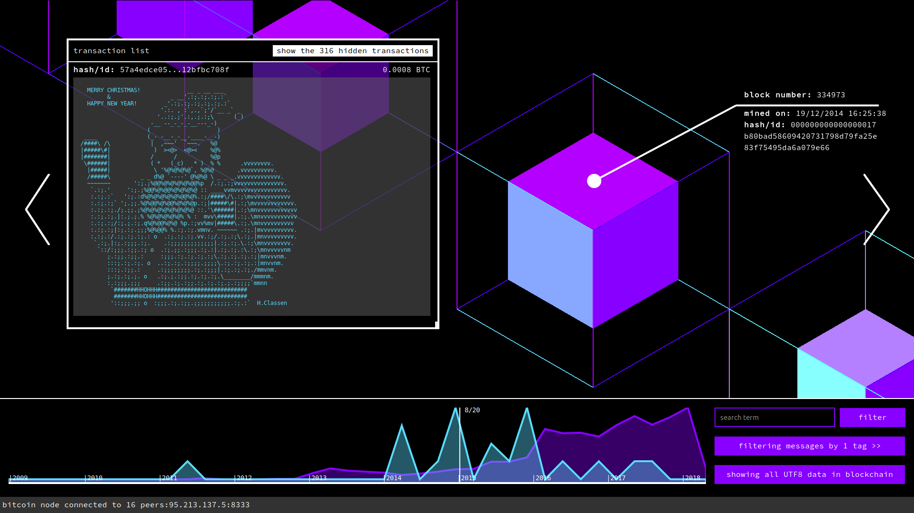

# Messages from the Mines



*Messages from the Mines* is an interactive art installation that excavates and interprets custom messages embedded in the Bitcoin blockchain. The distributed ledger contains hidden love messages, cryptic poems, ASCII art, signatures, eulogies and more. These messages are a creative misuse of the Bitcoin transaction protocol, a form of digital graffiti, unique—though overlooked—cultural artifacts forever embedded in one of the most contemporary digital technologies. 

Our project looks at the Bitcoin blockchain not from the traditional perspective of investors or programmers, but rather from a cultural perspective. We've built a system for extracting, archiving, researching, interpreting and annotating the messages left behind and document the evolution of this creative re-purposing of the blockchain. We approach this task not only as artists but also as anthropologists conducting contemporary media archeology; we seek an anthropological understanding of this phenomenon. Who are leaving these messages? What are their motivations and sentiments? What forms of anonymous communication occur on the ledger?

For more information about about the project, see [this large poster](.images/banner.png). 

## Install

This repository is comprised entirely of git submodules of other repositories. 

- `mftm-backend`: The Node.js backend server that hosts our frontend, REST API, and our internal message review tool.
- `mftm-frontend` (located in `mftm-backend/www/mftm-frontend`): The UI for exploring the blockchain messages (pictured above).
- `mftm-database`: Python code for extracting messages from the blockchain (using `bitcoind`'s `.dat` files) and constructing the MySQL database used by `mftm-backend`. 

```bash
# clone this repo
git clone https://github.com/brangerbriz/messages-from-the-mines
cd messages-from-the-mines

# recursively init and download the submodules
git submodule update --init --recursive
```

These install instructions are for Ubuntu 16.04. Other OSes may work but are not officially supported: here be dragons.

### Setting up the MySQL Database

```bash
# install mysql and optional GUI helpers
sudo apt update
sudo apt install mysql-server mysql-workbench

```

Now download the latest `messages_from_the_mines` database backup from [here (direct download)](https://github.com/brangerbriz/mftm-database/releases/download/data/latest.sql.gz). Unzip that file and you should get an `.sql` file like `2018-04-18.sql`.

```bash
# import the database backup (be sure to use the correct path to your database file)
# this will create a new Database schema called messages_from_the_mines
mysql -u root -p < 2018-04-18.sql
```

You may optionally create a new MySQL user to interface with the `messages_from_the_mines` database only. This is probably a good idea, as you have to save your database username/password in plaintext in `mftm-backend/config.json` and `mftm-database/config.json` (if actually want to parse the blockchain from this computer). This process is trivial using MySQL Workbench. Just be sure that your new user has full access permissions to the `messages_from_the_mines` database schema.

### Setting up the `mftm-backend` Node.js server

Once you've configured the MySQL database, detailed instructions to setup the backend server can be found in the [`mftm-backend/README.md`](mftm-backend/README.md) file. You should now follow those instructions before returning here.

## Run

## More Info

